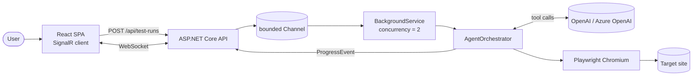

<h1 align="center">Synth</h1>

<p align="center">
  <strong>AI-generated synthetic browser tests, in plain English.</strong>
</p>

<p align="center">
  <em>Describe a flow. The agent opens a real browser, clicks through it, and ships a structured bug report.</em>
</p>

<p align="center">
  <a href="https://github.com/Gchandrakala1987/synth/actions/workflows/ci.yml"></a>
  
  
  
  
  
  
  <a href="LICENSE"></a>
</p>

---

## What it does

You type:

> "Test the checkout flow with a guest user."

The agent:

1. Spins up a headless Chromium via Playwright.
2. Drives an OpenAI tool-calling loop — `navigate`, `click`, `fill`, `read_page`, `assert`, `screenshot`.
3. Streams every step to the UI over SignalR as it happens.
4. Emits a structured `BugReport` with severity-ranked findings when it's done.

No hand-written test scripts. No brittle CSS selectors. Just the flow you wanted tested and the report you needed.

## Why it exists

Traditional UI tests are a treadmill — every product change breaks them, every regression slips through the gaps. LLMs with tool calling collapse the problem space: the agent rewrites its own plan per request, scoped to whatever you actually want exercised. This repo is a production-shaped implementation of that idea, sized to demonstrate the engineering rigor employers look for in QA automation, test infra, and applied-AI roles.

## Architecture at a glance



Full sequence diagram and design notes live in [`docs/ARCHITECTURE.md`](docs/ARCHITECTURE.md) and [`docs/AGENT_DESIGN.md`](docs/AGENT_DESIGN.md).

## Features

- **Plain-English instructions** — no DSL, no recorder, no Selenium IDE.
- **Real browser, real network** — Chromium driven by Playwright, not a mock DOM.
- **Live progress** — every tool call is fanned out over SignalR; the UI shows the agent thinking in real time.
- **Structured reports** — JSON `BugReport` with severity-ranked findings, reproduction strings, and step references. Easy to pipe into Jira / Linear.
- **Bounded by design** — per-step timeouts, max-step ceiling, capped queue, capped browser concurrency. The agent can't run away with your bill or your CPU.
- **Pluggable everywhere** — `ITestRunStore`, `IProgressPublisher`, `IAgentChatClientFactory`, `IBrowserToolbox` are all interfaces. Swap in Postgres, Service Bus, Anthropic, or a different driver without touching the loop.
- **Production-shaped** — Serilog → Application Insights, structured logging, health checks, Bicep IaC, GitHub Actions CI/CD, multi-stage Docker on the Playwright base image.

## Tech stack

| Layer        | Choices                                                                 |
|--------------|-------------------------------------------------------------------------|
| Backend      | C# / .NET 8, ASP.NET Core, SignalR, Serilog                             |
| Agent        | OpenAI .NET SDK v2 (chat.completions + tool calling), Azure OpenAI ready |
| Browser      | Microsoft Playwright (Chromium)                                          |
| Frontend     | React 18, TypeScript, Vite, `@microsoft/signalr`                         |
| Tests        | xUnit, FluentAssertions, NSubstitute                                     |
| Infra        | Azure App Service (Linux containers), Azure OpenAI, Log Analytics, App Insights, ACR — all via Bicep |
| CI/CD        | GitHub Actions: typecheck, lint, build, test, Docker build with cache; manual deploy job with OIDC to Azure |

## Quickstart

### Prereqs

- .NET 8 SDK
- Node.js 20+
- An OpenAI key **or** an Azure OpenAI deployment

### 1. Clone and set keys

```bash
git clone https://github.com/Gchandrakala1987/synth.git
cd synth
cp .env.example .env
# edit .env — set OPENAI__APIKEY (or the AZUREOPENAI__* trio)
```

### 2. Run the backend

```bash
cd src/Synth.Api
dotnet restore
dotnet run
# → listening on http://localhost:5080
# → first run installs Chromium (~1 min); subsequent runs are instant
```

### 3. Run the frontend

```bash
cd web
npm install
npm run dev
# → http://localhost:5173
```

Hit `http://localhost:5173`, pick an example, click **Run agent**, and watch the step list fill in as the agent works.

### Run with Docker

```bash
docker compose --env-file .env up --build api
cd web && npm install && npm run dev
```

The Docker image is based on `mcr.microsoft.com/playwright/dotnet`, so the browser binaries are baked in — no install step at container start.

## Example: what a run looks like

Instruction:

> "Add three todos, mark the second one complete, and verify the active counter shows 2."

Agent timeline (abbreviated):

```
#1  navigate    → https://demo.playwright.dev/todomvc           (Loaded HTTP 200)
#2  read_page   → accessibility snapshot acquired
#3  fill        → input.new-todo "Buy milk"                     (Filled)
#4  press       → Enter
#5  fill        → input.new-todo "Walk dog"                     (Filled)
#6  press       → Enter
#7  fill        → input.new-todo "Pay rent"                     (Filled)
#8  press       → Enter
#9  click       → li:nth-child(2) input.toggle                  (Clicked)
#10 assert      → text "2 items left" visible                   (PASS)
#11 finish_run  → Passed · 0 findings · 11 steps · 4.3s
```

Final `BugReport`:

```json
{
  "summary": "Added three todos and toggled the second; active counter correctly displays '2 items left'.",
  "overallSeverity": "Info",
  "findings": [],
  "stepsExecuted": 11,
  "duration": "00:00:04.3231120"
}
```

## Project layout

```
synth/
├── src/Synth.Api/        # ASP.NET Core: controllers, hub, agent loop, Playwright toolbox
├── tests/Synth.Tests/    # xUnit — store, tool schemas, JSON helpers
├── web/                           # React + Vite + SignalR client
├── infra/main.bicep               # Azure: App Service + Azure OpenAI + App Insights + ACR
├── docs/                          # ARCHITECTURE · AGENT_DESIGN · API
├── .github/workflows/             # ci.yml (build/test) + deploy.yml (manual, OIDC)
└── docker-compose.yml             # api in docker, web on host
```

## Deploying to Azure

```bash
az group create -n rg-synth-staging -l eastus

# Bicep deploys plan, app, ACR, OpenAI + model, Log Analytics, App Insights — wired together.
az deployment group create \
  -g rg-synth-staging \
  -f infra/main.bicep \
  -p namePrefix=synth containerImage=synthacr.azurecr.io/synth-api:latest
```

For ongoing deploys, configure the `AZURE_CLIENT_ID`, `AZURE_TENANT_ID`, `AZURE_SUBSCRIPTION_ID` repo secrets (Workload Identity Federation) and trigger the **deploy** workflow from the Actions tab.

## Engineering decisions worth highlighting

- **Tool-calling loop over chain-of-thought scratchpads.** Free-form CoT is harder to bound, harder to log, and harder to test. Tool calls are inspectable, time-boundable, and replay-friendly.
- **Accessibility tree, not DOM HTML, as the model's view of the page.** ~10× fewer tokens, far more stable across cosmetic markup changes. See [`docs/AGENT_DESIGN.md`](docs/AGENT_DESIGN.md#why-accessibility-trees-beat-dom-snapshots).
- **Hard ceilings on steps, time per step, queue depth, browser concurrency.** Every one of these is a bill-control or stability switch a real prod deploy wants.
- **In-memory store behind a 4-method interface.** Demo-friendly today; one binding swap from Postgres tomorrow.
- **Single point of LLM-provider coupling.** OpenAI vs Azure OpenAI is one factory class — `AgentChatClientFactory`. Anthropic / Bedrock land here too.

## Roadmap

- [ ] **Vision tool** — pass screenshots to GPT-4o / Claude for visual-bug detection.
- [ ] **Recorded sessions** — persist the conversation log; replay deterministically.
- [ ] **Postgres store** — proper persistence + multi-instance scale-out.
- [ ] **Per-tenant credential vault** — let the agent log in safely.
- [ ] **Cost guardrails** — token-budget per run, surfaced to the model.
- [ ] **Suite mode** — run a list of instructions against a URL, aggregate findings.

Contributions welcome — see [`CONTRIBUTING.md`](CONTRIBUTING.md).

## License

MIT — see [LICENSE](LICENSE).

---

<p align="center">
  Built by <a href="https://github.com/Gchandrakala1987">Chandrakala Dasari</a>.
  If this is useful to your team, give it a ⭐ — it makes the project easier to discover.
</p>
