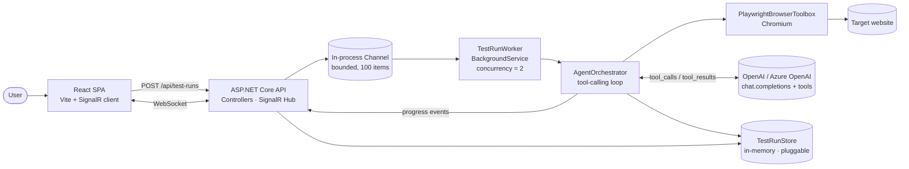
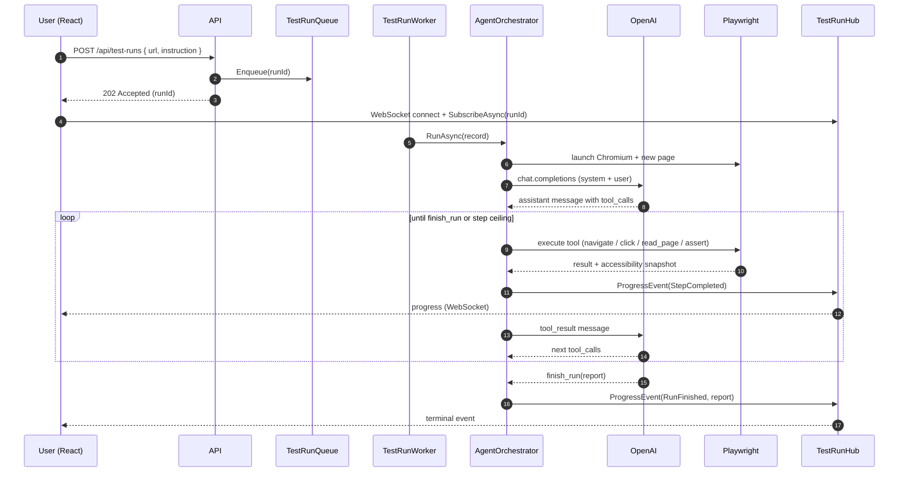

# Architecture

## System overview

## Request lifecycle

## Why these pieces

### Why an agent loop and not a static script?

A traditional test framework requires someone to write a script for every flow. The premise of
this project is that LLMs can *plan* a sequence of browser actions from a plain-English
instruction — so the script is regenerated per request, scoped to whatever the user actually
wants tested. Tool calling keeps the model on rails: it can only ever emit a
`navigate / click / fill / read_page / assert / screenshot / finish_run` call, never free-form
shell commands or arbitrary JavaScript.

### Why accessibility snapshots, not raw HTML?

Raw HTML for a real e-commerce page is tens of thousands of tokens, full of analytics noise.
Playwright's accessibility tree is ~10× smaller, semantically structured (role + name + state),
and far more stable across cosmetic markup changes. The model picks better selectors when the
input is structured the same way humans reason about a page.

### Why SignalR over plain WebSockets or Server-Sent Events?

SignalR handles reconnect, group fan-out, and transport negotiation (WebSocket → SSE → long
poll) for us. The agent loop emits per-step events to a single group keyed by `runId`; multiple
tabs watching the same run all get the same stream without bespoke pub/sub plumbing.

### Why a background worker and a queue?

HTTP requests should never block on a 30-second browser run. The controller queues a run and
returns `202 Accepted` immediately. The `TestRunWorker` pulls from a bounded `Channel<Guid>`
and runs at most two concurrent agents — each Chromium instance costs ~150MB RSS, so this is
the knob you tune when sizing the host. The queue is in-process for the MVP; swap for a real
broker (Service Bus, SQS, Kafka) by changing one binding.

### Why an in-memory store?

The MVP needs storage for ~minutes per run, not durability. The `ITestRunStore` interface is
small (4 methods) on purpose — drop in Postgres/Cosmos/Table Storage with a single binding
change. No business logic moves.

### Why hard step + time limits?

A buggy or adversarial site can lead the model into a loop forever. The orchestrator enforces:

- `Agent:MaxSteps` (default 25) — tool calls per run.
- `Agent:StepTimeoutSeconds` (default 20) — wall clock per individual tool call.
- Bounded channel capacity (100) — backpressure on incoming runs.

Hitting any of these emits a structured finding rather than crashing.

## Observability

Application Insights (configured by `infra/main.bicep`) captures:

- Per-request traces (Serilog → AppInsights via `APPLICATIONINSIGHTS_CONNECTION_STRING`).
- SignalR hub invocations.
- Failed agent steps as exceptions (logged at `LogLevel.Error`).
- Custom dimensions: `runId`, `tool`, `model`, `stepIndex`.

The default Log Analytics retention is 30 days — enough to debug a regression without
breaking the free tier.

## Trade-offs that aren't in the code

| Decision | Why we chose it | When you'd change it |
|---|---|---|
| Single-process worker | Lowest operational cost; fine for ≤ 2 concurrent agents. | Scale-out: hoist `TestRunQueue` to Service Bus, run N workers behind a load balancer. |
| In-memory store | Zero ops; round-trip safe for the MVP. | Multi-instance deploy → Postgres / Cosmos. |
| OpenAI chat.completions | Battle-tested tool-calling API. | Switch providers (Anthropic, Bedrock) by writing a new `IAgentChatClientFactory`. |
| Browser per run | Hard isolation between flows; predictable cleanup. | Browser pooling for high-throughput hosted scenarios. |
| Auth: none | Keeps the demo trivial. | Add Entra ID + per-tenant rate limits before shipping a SaaS. |
